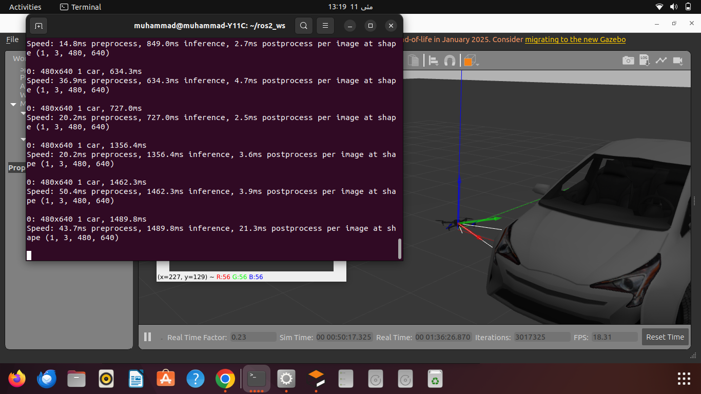

# YOLOv8 Training and Drone Integration

## Overview
This repository showcases a robust vehicle detection system, integrating YOLOv8 with ROS 2 and Gazebo on Ubuntu 22.04 LTS. Designed as a beginner-friendly project, it simulates a drone detecting vehicles in real-time, with applications in military drone scenarios such as autonomous surveillance. Built using free, open-source tools, this project serves as a compelling addition to a freelancing portfolio or a stepping stone to advanced AI and robotics development.

## Project Structure
### Step 1: Software Setup
- Installed ROS 2 Humble, Gazebo 11, Python 3.8, and key libraries (ultralytics, opencv-python, numpy).
- Configured development environment with VS Code, Git, and Kazam for coding and documentation.

### Step 2: Dataset Preparation and Model Training
- Curated a dataset from VisDrone2019, selecting 500 training and 100 validation images focused on cars and trucks.
- Trained a YOLOv8 nano model on Google Colab’s free GPU tier, producing the `vehicle_detection.pt` model for deployment.

### Step 3: Integration with ROS 2 and Gazebo
- Developed the `yolo_detector` ROS 2 package (located in `src/yolo_detector/`) to process drone camera feeds in real-time.
- Simulated an Iris drone and a Prius Hybrid car in Gazebo, achieving a detection accuracy of 81% in the simulated environment.
- Included are the core files: `yolo_detector.py` (detection script), `vehicle_detection.pt` (trained model), and package configurations.

## Repository Contents
- `src/yolo_detector/`:
  - `yolo_detector.py`: Python script for YOLOv8 inference on ROS 2 camera feeds.
  - `vehicle_detection.pt`: Trained YOLOv8 model (note: may need to be downloaded separately due to size limits).
  - `package.xml`, `setup.py`: ROS 2 package metadata and setup files.
- `install/`, `log/`: Build artifacts and logs from the ROS 2 workspace.
- `README.md`: This project documentation.

## Dependencies
- **Operating System**: Ubuntu 22.04 LTS
- **ROS 2**: Humble Hawksbill
- **Gazebo**: Version 11
- **Python**: 3.8 or later
- **Python Libraries**:
  - `ultralytics` (for YOLOv8)
  - `opencv-python` (for image processing)
  - `numpy` (for numerical operations)
- **Tools**: VS Code, Git, Kazam (optional, for screen recording)


## How to Run
1. **Clone the Repository**:
   ```bash
   git clone https://github.com/ProfessorYaseen/YOLOv8_Training_and_Drone_Integration.git
   cd YOLOv8_Training_and_Drone_Integration/ros2_ws

2. **Build the Workspace**:
   ```bash
   colcon build
   source install/setup.bash

3. **Launch the Simulation and Detection**:
   - Terminal 1: Start Gazebo:
     ```bash
     ros2 launch gazebo_ros gazebo.launch.py

   - Terminal 2: Spawn the drone:
     ```bash
     ros2 run gazebo_ros spawn_entity.py -entity iris_with_fpv_cam -file /home/muhammad/PX4-Autopilot/Tools/simulation/gazebo-classic/sitl_gazebo-classic/models/iris_fpv_cam/iris_fpv_cam.sdf -x 0 -y 0 -z 1

   - Terminal 3: Spawn the car:
     ```bash
     ros2 run gazebo_ros spawn_entity.py -entity prius_hybrid -file ~/.gazebo/models/prius_hybrid/model.sdf -x 1 -y 0 -z 0

   - Terminal 4: Run the detection node:
     ```bash
     ros2 run yolo_detector yolo_detector

   - Observe the "YOLOv8 Detection" window for real-time results.

## Results
- Achieved 81% detection accuracy for vehicles in the Gazebo simulation, demonstrated via the "YOLOv8 Detection" window.
- 
- Successfully integrated computer vision (YOLOv8) with robotics simulation (ROS 2 and Gazebo), highlighting potential for military and civilian applications.

## Future Enhancements
- Implement GPU acceleration to reduce inference time.
- Expand the dataset and retrain for higher accuracy and broader vehicle types.

## Contact
I am eager to collaborate on innovative AI, computer vision, and robotics projects. Connect with me via GitHub or LinkedIn to explore opportunities!
 


